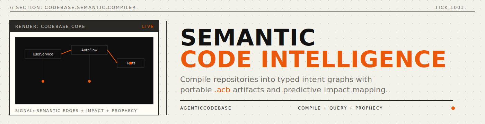
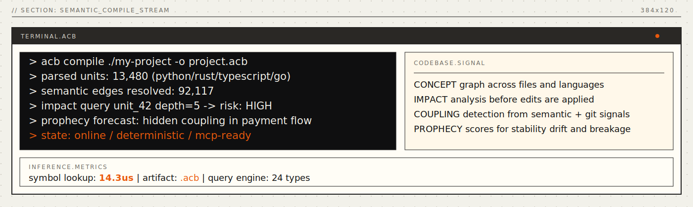
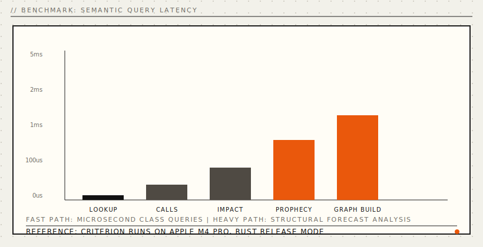
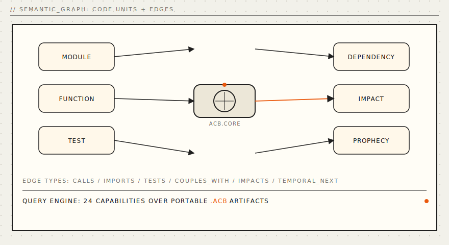
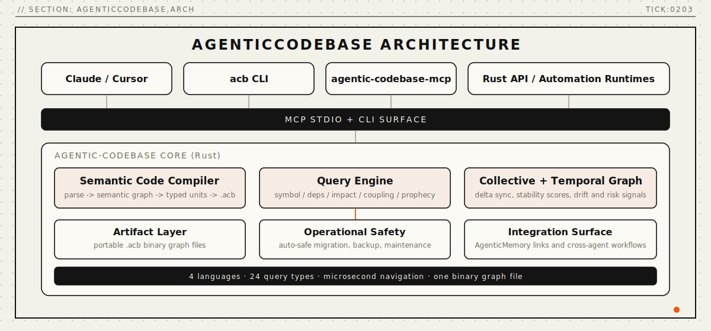
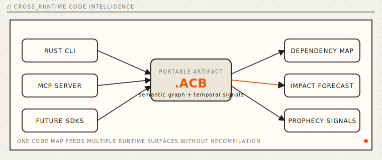

<p align="center">
  
</p>

<p align="center">
  <a href="#install"></a>
  <a href="#mcp-server"></a>
  <a href="LICENSE"></a>
  <a href="paper/paper-i-semantic-compiler/agenticcodebase-paper.pdf"></a>
</p>

<p align="center">
  <a href="#quickstart">Quickstart</a> · <a href="#why-agenticcodebase">Why</a> · <a href="#benchmarks">Benchmarks</a> · <a href="#the-query-engine">Query Engine</a> · <a href="#mcp-server">MCP Server</a> · <a href="#install">Install</a> · <a href="INSTALL.md">Full Install Guide</a> · <a href="docs/api-reference.md">API</a> · <a href="paper/paper-i-semantic-compiler/agenticcodebase-paper.pdf">Paper</a>
</p>

---

## AI agents can't understand code across sessions.

Your agent reads a file, analyzes one function, and forgets. Next session -- blank slate. It can't recall the architecture it mapped yesterday. It can't trace the impact chain from three conversations ago. It can't search its own understanding of your codebase.

RAG over source files doesn't work. You get "similar text," never *"what breaks if I change this?"*. Embedding chunks loses all structure -- no call graphs, no dependency chains, no type relationships. Grep is fast but flat.

**AgenticCodebase** compiles your repository into a navigable concept graph stored in a single binary file. Not "search your source code." Your agent has a **map** -- functions, classes, modules, imports, call chains, type hierarchies -- all connected, all queryable in microseconds.

```bash
# Compile any repository (Python, Rust, TypeScript, Go)
acb compile ./my-project -o project.acb

# Query it
acb query project.acb symbol --name "UserService"     # Find symbols
acb query project.acb impact --unit-id 42              # What breaks?
acb query project.acb prophecy --limit 10              # What will break next?
```

Four languages. Twenty-four query types. One file holds everything. Sub-microsecond lookups. Works with Claude Desktop, VS Code, Cursor, Windsurf, and any MCP-compatible client.

<p align="center">
  
</p>

---

<a name="benchmarks"></a>

## Benchmarks

Rust core. Tree-sitter parsing. Binary `.acb` format. Real numbers from `cargo bench --release`:

<p align="center">
  
</p>

| Operation | 1K units | 10K units | Notes |
|:---|---:|---:|:---|
| Graph build | **388 us** | **3.77 ms** | Semantic analysis + edge resolution |
| Write .acb | **169 us** | **2.29 ms** | LZ4-compressed binary format |
| Read .acb | **473 us** | **4.91 ms** | Memory-mapped I/O |

| Query (10K graph) | Latency | Notes |
|:---|---:|:---|
| Symbol lookup (exact) | **14.3 us** | Hash-based, O(1) |
| Dependency graph (depth 5) | **925 ns** | BFS traversal |
| Impact analysis | **1.46 us** | With risk scoring |
| Call graph (depth 3) | **1.27 us** | Bidirectional |

> All benchmarks on Apple M4 Pro, macOS, Rust 1.90.0 `--release`. Criterion 0.5 with 100 iterations after warm-up.

---

<a name="why-agenticcodebase"></a>

## Why AgenticCodebase?

<p align="center">
  
</p>

| Approach | Finds symbols | Traces dependencies | Predicts impact | Persists across sessions | Sub-ms queries |
|:---|:---:|:---:|:---:|:---:|:---:|
| grep / ripgrep | partial | no | no | no | yes |
| LSP / IDE | yes | partial | no | no | varies |
| RAG over source | partial | no | no | yes | no |
| **AgenticCodebase** | **yes** | **yes** | **yes** | **yes** | **yes** |

---

<a name="quickstart"></a>

## Quickstart

### Install

```bash
cargo install agentic-codebase
```

### Compile a codebase

```bash
# Parse and compile a repository into a .acb graph
acb compile ./my-project -o project.acb

# View graph metadata
acb info project.acb

# Query symbols
acb query project.acb symbol --name "UserService"

# Impact analysis -- what breaks if I change unit 42?
acb query project.acb impact --unit-id 42 --depth 5

# Code prophecy -- what's likely to break next?
acb query project.acb prophecy --limit 10
```

<a name="mcp-server"></a>

### MCP Server

```bash
# Start the MCP server (stdio transport)
acb-mcp
```

`acb-mcp` accepts both line-delimited JSON-RPC and `Content-Length` framed MCP stdio messages.

Configure in Claude Desktop (`claude_desktop_config.json`):

```json
{
  "mcpServers": {
    "agentic-codebase": {
      "command": "acb-mcp",
      "args": []
    }
  }
}
```

See the [Full Install Guide](INSTALL.md) for VS Code, Cursor, and Windsurf configuration.

---

<a name="the-query-engine"></a>

## The Query Engine

AgenticCodebase provides 24 query types across three tiers:

### Core Queries (8)

| Query | CLI | Description |
|:---|:---|:---|
| Symbol lookup | `acb query ... symbol -n <name>` | Find code units by name (exact, prefix, contains) |
| Dependency graph | `acb query ... deps -u <id>` | Forward dependencies with depth control |
| Reverse dependency | `acb query ... rdeps -u <id>` | Who depends on this unit? |
| Call graph | `acb query ... calls -u <id>` | Function call chains (callers + callees) |
| Similarity | `acb query ... similar -u <id>` | Structurally similar code units |
| Type hierarchy | via library API | Inheritance and implementation chains |
| Containment | via library API | Module/class nesting relationships |
| Pattern match | via library API | Structural code pattern detection |

### Built Queries (5)

| Query | CLI | Description |
|:---|:---|:---|
| Impact analysis | `acb query ... impact -u <id>` | Risk-scored change impact with test coverage |
| Coverage | via library API | Test coverage mapping |
| Trace | via library API | Execution path tracing |
| Path | via library API | Shortest path between two units |
| Reverse | via library API | Reverse call/dependency chains |

### Novel Queries (11)

| Query | CLI | Description |
|:---|:---|:---|
| Prophecy | `acb query ... prophecy` | Predict which units will break next |
| Stability | `acb query ... stability -u <id>` | Stability score with contributing factors |
| Coupling | `acb query ... coupling` | Detect tightly coupled unit pairs |
| Collective | via library API | Cross-repository pattern extraction |
| Temporal | via library API | Git history evolution analysis |
| Dead code | via library API | Unreachable code detection |
| Concept | via library API | Abstract concept clustering |
| Migration | via library API | Language migration planning |
| Test gap | via library API | Missing test identification |
| Drift | via library API | Code drift detection over time |
| Hotspot | via library API | Change frequency hotspot analysis |

---

## How It Works

AgenticCodebase compiles source code into a semantic graph, writes it to a portable `.acb` binary, and serves query + MCP surfaces on top of that graph.

## Architecture

AgenticCodebase models source code as a directed graph G = (U, E) where each vertex is a typed CodeUnit and each edge carries a semantic relationship.

<p align="center">
  
</p>

### Compilation Pipeline

```
Source Files (Py/Rust/TS/Go)
    -> tree-sitter Parse
    -> Semantic Analysis
    -> Graph Builder
    -> .acb Binary
```

### Binary Format (.acb)

| Section | Size | Description |
|:---|:---|:---|
| Header | 128 B | Magic, version, counts, offsets |
| Unit Table | 96N B | Fixed-size unit records (O(1) access) |
| Edge Table | 40M B | Fixed-size edge records |
| String Pool | Variable | LZ4-compressed names and paths |
| Feature Vectors | Variable | f32 embedding arrays |

### Code Unit Types (13)

Function, Method, Class, Struct, Enum, Interface, Trait, Module, Import, Variable, Constant, TypeAlias, Macro

### Edge Types (18)

Calls, CalledBy, Imports, ImportedBy, Contains, ContainedBy, Inherits, InheritedBy, Implements, ImplementedBy, Uses, UsedBy, Returns, Accepts, Overrides, OverriddenBy, Tests, TestedBy

---

<a name="install"></a>

## Install

```bash
cargo install agentic-codebase
```

Install script (binary release + MCP config merge):

```bash
curl -fsSL https://agentralabs.tech/install/codebase | bash
```

Environment profiles (one command per environment):

```bash
# Desktop MCP clients (auto-merge Claude Desktop + Claude Code when detected)
curl -fsSL https://agentralabs.tech/install/codebase/desktop | bash

# Terminal-only (no desktop config writes)
curl -fsSL https://agentralabs.tech/install/codebase/terminal | bash

# Remote/server hosts (no desktop config writes)
curl -fsSL https://agentralabs.tech/install/codebase/server | bash
```

| Channel | Command | Result |
|:---|:---|:---|
| crates.io (official) | `cargo install agentic-codebase` | Installs both `acb` and `acb-mcp` |
| GitHub installer (official) | `curl -fsSL https://agentralabs.tech/install/codebase \| bash` | Installs release binaries when available, otherwise source fallback; merges MCP config |
| GitHub installer (desktop profile) | `curl -fsSL https://agentralabs.tech/install/codebase/desktop \| bash` | Explicit desktop profile behavior |
| GitHub installer (terminal profile) | `curl -fsSL https://agentralabs.tech/install/codebase/terminal \| bash` | Installs binaries only; no desktop config writes |
| GitHub installer (server profile) | `curl -fsSL https://agentralabs.tech/install/codebase/server \| bash` | Installs binaries only; server-safe behavior |

## Deployment Model

- **Standalone by default:** AgenticCodebase is independently installable and operable. Integration with AgenticMemory or AgenticVision is optional, never required.
- **Autonomic operations by default:** compile/runtime maintenance uses safe profile-based defaults with rolling backups, migration safeguards, collective cache maintenance, and health-ledger snapshots.

| Area | Default behavior | Controls |
|:---|:---|:---|
| Autonomic profile | Conservative local-first posture | `ACB_AUTONOMIC_PROFILE=desktop|cloud|aggressive` |
| Rolling backup | Compile writes checkpointed backups for existing outputs | `ACB_AUTO_BACKUP`, `ACB_AUTO_BACKUP_RETENTION`, `ACB_AUTO_BACKUP_DIR` |
| Storage migration | Policy-gated with checkpointed auto-safe path | `ACB_STORAGE_MIGRATION_POLICY=auto-safe|strict|off` |
| Collective cache maintenance | Periodic expiry cleanup of collective cache entries | `ACB_COLLECTIVE_CACHE_MAINTENANCE_SECS` |
| Maintenance throttling | SLA-aware under sustained registry load | `ACB_SLA_MAX_REGISTRY_OPS_PER_MIN` |
| Health ledger | Periodic operational snapshots (default: `~/.agentra/health-ledger`) | `ACB_HEALTH_LEDGER_DIR`, `AGENTRA_HEALTH_LEDGER_DIR`, `ACB_HEALTH_LEDGER_EMIT_SECS` |

See the [Full Installation Guide](INSTALL.md) for all options including MCP server setup, library usage, and build-from-source instructions.

---

## Integration with Agentic Ecosystem

AgenticCodebase is part of the Agentic ecosystem:

- **[AgenticMemory](https://github.com/agentralabs/agentic-memory)** -- Persistent, navigable memory for AI agents
- **[AgenticVision](https://github.com/agentralabs/agentic-vision)** -- Visual memory and image understanding for AI agents
- **AgenticCodebase** -- Semantic code understanding for AI agents

All three share the MCP protocol for seamless AI agent integration. Run all three servers together for an agent with memory, vision, and code understanding.

<p align="center">
  
</p>

---

## Implementation

- **Language**: Rust
- **Source files**: 58
- **Lines of code**: 13,709
- **Tests**: 432 (38 unit + 394 integration)
- **Benchmarks**: 21 Criterion benchmarks
- **Clippy warnings**: 0
- **Supported languages**: Python, Rust, TypeScript, Go

## Contributing

See [CONTRIBUTING.md](CONTRIBUTING.md) for development setup and guidelines.

## License

MIT -- see [LICENSE](LICENSE) for details.

---

<p align="center">
  <sub>Built by <a href="https://github.com/agentralabs"><strong>Agentra Labs</strong></a></sub>
</p>
